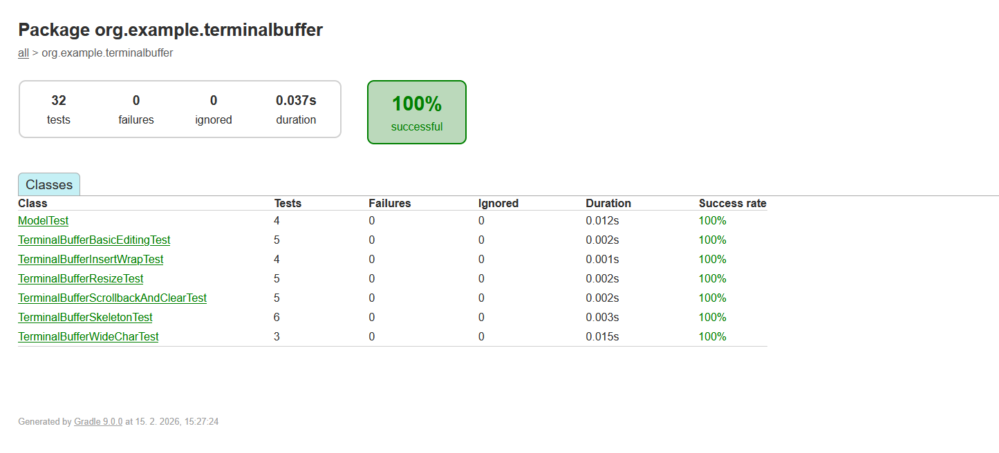

# Terminal Buffer (Test Task)

A minimal terminal text buffer implementation in **Java**.

The buffer models a terminal as:
- **Screen**: a fixed-size editable grid (width × height)
- **Scrollback**: a fixed-capacity history of lines that scrolled off the top (read-only)

Each cell stores:
- Unicode code point (or empty)
- Foreground color: default or one of 16 terminal colors
- Background color: default or one of 16 terminal colors
- Style flags: bold / italic / underline

This repository contains the core data structure and unit tests (no UI / real terminal emulation).

## Requirements

- Gradle Wrapper included
- Java toolchain: **21** (configured via Gradle toolchains)

## Build & test

Run unit tests:

```sh
./gradlew test
```

## Run demo

A small console demo is provided:

```sh
./gradlew run
```

Note: some Windows consoles may render emoji as ? depending on font/encoding. Unit tests validate stored code points and continuation cells.

## Implemented API (high-level)

### Setup

* Configurable initial width, height
* Configurable scrollbackMax (max number of lines)

### Attributes

* Set/reset current attributes (fg/bg + style flags).
Current attributes are applied to subsequent edits.

### Cursor

* Get/set cursor position (col, row)
* Move cursor up/down/left/right by N cells (clamped to screen bounds)

### Editing

Operations that use current cursor position and attributes:

* write(text) — overwrite from cursor on the current line, moving the cursor
* insert(text) — insert with shifting; may wrap to the next line; may scroll, moving the cursor
* fillLine(row, codePointOrZero) — fill a screen line with a character (or empty)

Operations independent of cursor/attributes:

* insertEmptyLineAtBottom() — scroll screen up; pushes the top line into scrollback
* clearScreen() — clears screen only
* clearAll() — clears screen and scrollback

### Content access

* Get code point at position (screen + scrollback)
* Get attributes at position (screen + scrollback)
* Get a line as string (screen + scrollback)
* Get entire screen as string
* Get screen + scrollback as string

## Bonus features

### Resize
```resize(newWidth, newHeight):```

* Width increase: pads to the right with empty cells
* Width decrease: truncates right side
* Height increase: adds empty lines at the bottom
* Height decrease: removed top lines are appended to scrollback
* Cursor is clamped to new bounds

### Wide characters (2-cell)

Some characters (emoji/CJK) are treated as width=2:
* The first cell stores the character code point
* The second cell stores a special continuation marker cell

Rendering treats continuation cells as spaces.

## Notes

* Terminal “wcwidth” and grapheme clusters are approximated with a simple heuristic (sufficient for the bonus requirement).
* More details and trade-offs are described in ```DECISIONS.md```.

## Test report

All tests pass locally via `./gradlew test`.

